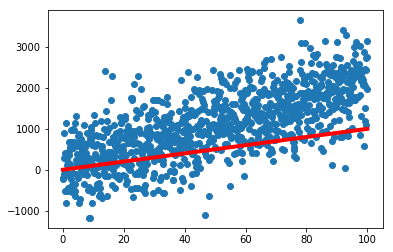
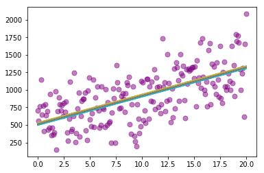

### Questions

### Objectives

### Outline


```python
import pandas as pd
import numpy as np


import matplotlib.pyplot as plt
import seaborn as sns
```


```python
# I'm going to make some data 
x = np.linspace(0, 20, 200)
m = np.random.randint(20, 50)
b = np.random.randint(10, 30)
noise = np.random.normal(500, 300, 200)

y = m*x + b + noise
```


```python
plt.scatter(x, y, s=50, c='purple', alpha=0.5)
plt.show()
```





```python
def RMSE(y, yhat):
    residuals = y - yhat
    return np.sqrt(np.mean(residuals**2))

def RMSE_Lasso(y, yhat, lam, coefficients):
    residuals = y - yhat
    return np.sqrt(np.mean(residuals**2)) + lam*np.sum(np.abs(coefficients))


def RMSE_Ridge(y, yhat, lam, coefficients):
    residuals = y - yhat
    return np.sqrt(np.mean(residuals**2)) + lam*np.sum(np.power(coefficients, 2))
```


```python
# What is the goal?! 
# Find a model that best describes the data
# How do we find a model? (Assume Linear Regression)

# Hunting down the best B0 and B1 to fit our data. 
B0 = np.linspace(0, 1000, 500) # bias
B1 = np.linspace(0, 500, 100) # coefficient
errors = []
for b0 in B0:
    for b1 in B1:
        yhat = b0 + b1*x
        error = RMSE(y, yhat)
        errors.append(([b0, b1], error))
```


```python
errors = sorted(errors, key=lambda x: x[1], reverse=False)
errors[:5]
```


    [([515.0300601202405, 40.4040404040404], 291.01775005745435),
     ([513.0260521042084, 40.4040404040404], 291.0186053034239),
     ([517.0340681362725, 40.4040404040404], 291.03069453326157),
     ([511.0220440881763, 40.4040404040404], 291.03326014951233),
     ([519.0380761523046, 40.4040404040404], 291.0574368896607)]


```python
plt.scatter(x, y, s=50, c='purple', alpha=0.5)
for p in errors[:20]:
    yhat = p[0][0] + p[0][1]*x
    plt.plot(x, yhat)
plt.show()
```





### Assessment
