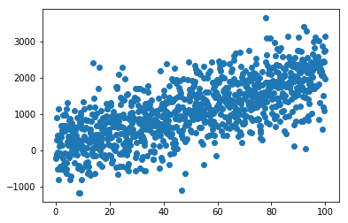
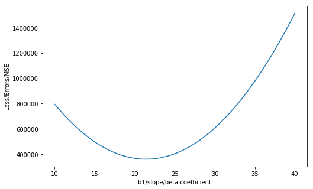

## Questions
- 

## Objectives
- define a loss function
- define the inputs of a loss function
- explain how gradient descent is applied to solving regression problems

## Outline
- create some data (2d x v y)
- run regression on that data
- find the best parameters of our data
- compare and contrast this w/ gradient descent

## Keyterms
- Loss (cost) Function: 
    - Example: 
            - r2 - measures error
            - rmse - measures error
    - Way to measure error

- What are the parameters of a loss function?
    - for 2d linear regression
        - slope and intercept
    - Loss is a function of the Beta coefficients

- Min Loss
    - Minimum Loss Value (minimum loss)
    - So we're hunting for the best beta value that will minimize error

# Example


```python
import numpy as np

import matplotlib.pyplot as plt
```


```python
x = np.linspace(0, 100, 1000)

b1 = np.random.randint(20, 30)
b0 = np.random.randint(20, 30)

noise = np.random.normal(50, 600, 1000)

y = b0 + b1*x + noise

plt.scatter(x, y)
plt.show()
```





```python
# I'm going to guess a best fit formula

b0_guess = 0
b1_guess =  10

y_hat = b0_guess + b1_guess*x

plt.scatter(x, y)
plt.plot(x, y_hat, c='r', linewidth=4)
plt.show()
```


```python
def mse(y, yhat):
    return np.mean((y - yhat)**2)
```


```python
mse(y, y_hat)
```


    2685413.4530737377


```python
b1_guesses = np.linspace(10, 40, 100)
```


```python
errors = []

for b1_guess in b1_guesses:
    y_hat = b0_guess + b1_guess*x
    error = mse(y, y_hat)
    errors.append(error)
```


```python
plt.figure(figsize=(8, 5))
plt.plot(b1_guesses, errors)
plt.ylabel("Loss/Errors/MSE")
plt.xlabel("b1/slope/beta coefficient")
plt.show()
```





```python
# index of min error
lowest_error_index = np.argmin(errors)

b1_best = b1_guesses[lowest_error_index]
b1_best
```


    21.515151515151516


# So I found the best b1 with a b0 = 0

# But this isn't the best line


```python
b0_guesses = np.linspace(-20, 20, 100)
```


```python
errors = []

for b0_guess in b0_guesses:
    for b1_guess in b1_guesses:
        y_hat = b0_guess + b1_guess * x
        error = mse(y, y_hat)
        errors.append((error, b0_guess, b1_guess))
```


```python
sorted_errors = sorted(errors)
sorted_errors
```


    [(360205.1784106772, 20.0, 21.21212121212121),
     (360210.72543245327, 19.5959595959596, 21.21212121212121),
     (360216.5989515256, 19.19191919191919, 21.21212121212121),
     (360222.79896789405, 18.78787878787879, 21.21212121212121),
     (360229.3254815587, 18.38383838383838, 21.21212121212121),
     (360236.1784925196, 17.97979797979798, 21.21212121212121),
     (360243.3580007767, 17.575757575757578, 21.21212121212121),
     (360250.8640063299, 17.17171717171717, 21.21212121212121),
     (360258.69650917937, 16.767676767676768, 21.21212121212121),
     (360266.85550932493, 16.36363636363636, 21.21212121212121),
     (360275.3410067668, 15.959595959595958, 21.21212121212121),
     (360284.15300150483, 15.555555555555557, 21.21212121212121),
     (360288.5357599647, 20.0, 20.90909090909091),
     (360293.29149353906, 15.151515151515149, 21.21212121212121),
     (360302.75648286944, 14.747474747474747, 21.21212121212121),
     (360306.32643034816, 19.5959595959596, 20.90909090909091),
     (360312.54796949605, 14.343434343434346, 21.21212121212121),
     (360322.66595341894, 13.939393939393938, 21.21212121212121),
     (360324.4435980277, 19.19191919191919, 20.90909090909091),
     (360333.11043463787, 13.535353535353536, 21.21212121212121),
     (360342.8872630034, 18.78787878787879, 20.90909090909091),
     (360343.881413153, 13.131313131313128, 21.21212121212121),
     (360354.97888896446, 12.727272727272727, 21.21212121212121),
     (360361.6574252754, 18.38383838383838, 20.90909090909091),
     (360366.40286207205, 12.323232323232325, 21.21212121212121),
     (360378.1533324758, 11.919191919191917, 21.21212121212121),
     (360380.7540848435, 17.97979797979798, 20.90909090909091),
     (360390.2303001758, 11.515151515151516, 21.21212121212121),
     (360400.1772417079, 17.575757575757578, 20.90909090909091),
     (360402.6337651719, 11.11111111111111, 21.21212121212121),
     (360415.36372746434, 10.707070707070706, 21.21212121212121),
     (360419.92689586844, 17.17171717171717, 20.90909090909091),
     (360428.42018705286, 10.303030303030301, 21.21212121212121),
     (360440.0030473251, 16.767676767676768, 20.90909090909091),
     (360441.80314393766, 9.8989898989899, 21.21212121212121),
     (360455.51259811857, 9.494949494949495, 21.21212121212121),
     (360460.4056960781, 16.36363636363636, 20.90909090909091),
     (360469.54854959564, 9.09090909090909, 21.21212121212121),
     (360481.1348421272, 15.959595959595958, 20.90909090909091),
     (360483.91099836904, 8.686868686868685, 21.21212121212121),
     (360498.59994443855, 8.282828282828284, 21.21212121212121),
     (360502.1904854725, 15.555555555555557, 20.90909090909091),
     (360513.61538780434, 7.878787878787879, 21.21212121212121),
     (360523.572626114, 15.151515151515149, 20.90909090909091),
     (360528.9573284662, 7.474747474747474, 21.21212121212121),
     (360544.6257664243, 7.070707070707069, 21.21212121212121),
     (360545.28126405174, 14.747474747474747, 20.90909090909091),
     (360560.62070167856, 6.666666666666668, 21.21212121212121),
     (360567.3163992856, 14.343434343434346, 20.90909090909091),
     (360576.94213422906, 6.262626262626263, 21.21212121212121),
     (360589.6780318157, 13.939393939393938, 20.90909090909091),
     (360593.5900640758, 5.858585858585858, 21.21212121212121),
     (360610.5644912187, 5.454545454545453, 21.21212121212121),
     (360612.36616164196, 13.535353535353536, 20.90909090909091),
     (360627.86541565775, 5.050505050505048, 21.21212121212121),
     (360635.38078876445, 13.131313131313128, 20.90909090909091),
     (360645.4928373931, 4.646464646464647, 21.21212121212121),
     (360658.72191318317, 12.727272727272727, 20.90909090909091),
     (360662.24515811226, 11.515151515151516, 21.515151515151516),
     (360662.4049745012, 11.11111111111111, 21.515151515151516),
     (360662.4118390197, 11.919191919191917, 21.515151515151516),
     (360662.89128818625, 10.707070707070706, 21.515151515151516),
     (360662.9050172231, 12.323232323232325, 21.515151515151516),
     (360663.4467564245, 4.242424242424242, 21.21212121212121),
     (360663.70409916755, 10.303030303030301, 21.515151515151516),
     (360663.72469272284, 12.727272727272727, 21.515151515151516),
     (360664.84340744495, 9.8989898989899, 21.515151515151516),
     (360664.8708655187, 13.131313131313128, 21.515151515151516),
     (360666.3092130186, 9.494949494949495, 21.515151515151516),
     (360666.3435356108, 13.535353535353536, 21.515151515151516),
     (360668.1015158885, 9.09090909090909, 21.515151515151516),
     (360668.1427029991, 13.939393939393938, 21.515151515151516),
     (360670.2203160546, 8.686868686868685, 21.515151515151516),
     (360670.26836768363, 14.343434343434346, 21.515151515151516),
     (360672.6656135168, 8.282828282828284, 21.515151515151516),
     (360672.72052966425, 14.747474747474747, 21.515151515151516),
     (360675.43740827526, 7.878787878787879, 21.515151515151516),
     (360675.49918894115, 15.151515151515149, 21.515151515151516),
     (360678.53570032975, 7.474747474747474, 21.515151515151516),
     (360678.6043455142, 15.555555555555557, 21.515151515151516),
     (360681.72717275214, 3.8383838383838373, 21.21212121212121),
     (360681.96048968064, 7.070707070707069, 21.515151515151516),
     (360682.0359993834, 15.959595959595958, 21.515151515151516),
     (360682.389534898, 12.323232323232325, 20.90909090909091),
     (360685.71177632775, 6.666666666666668, 21.515151515151516),
     (360685.7941505489, 16.36363636363636, 21.515151515151516),
     (360689.7895602709, 6.262626262626263, 21.515151515151516),
     (360689.87879901053, 16.767676767676768, 21.515151515151516),
     (360694.1938415103, 5.858585858585858, 21.515151515151516),
     (360694.2899447684, 17.17171717171717, 21.515151515151516),
     (360698.92462004593, 5.454545454545453, 21.515151515151516),
     (360699.02758782246, 17.575757575757578, 21.515151515151516),
     (360700.334086376, 3.4343434343434325, 21.21212121212121),
     (360703.98189587775, 5.050505050505048, 21.515151515151516),
     (360704.0917281727, 17.97979797979798, 21.515151515151516),
     (360706.3836539091, 11.919191919191917, 20.90909090909091),
     (360709.3656690056, 4.646464646464647, 21.515151515151516),
     (360709.4823658191, 18.38383838383838, 21.515151515151516),
     (360715.07593942987, 4.242424242424242, 21.515151515151516),
     (360715.1995007617, 18.78787878787879, 21.515151515151516),
     (360719.2674972961, 3.030303030303031, 21.21212121212121),
     (360721.1127071502, 3.8383838383838373, 21.515151515151516),
     (360721.2431330005, 19.19191919191919, 21.515151515151516),
     (360727.4759721668, 3.4343434343434325, 21.515151515151516),
     (360727.6132625355, 19.5959595959596, 21.515151515151516),
     (360730.70427021635, 11.515151515151516, 20.90909090909091),
     (360734.1657344796, 3.030303030303031, 21.515151515151516),
     (360734.30988936673, 20.0, 21.515151515151516),
     (360738.52740551234, 2.6262626262626263, 21.21212121212121),
     (360741.1819940885, 2.6262626262626263, 21.515151515151516),
     (360748.5247509937, 2.2222222222222214, 21.515151515151516),
     (360755.35138381977, 11.11111111111111, 20.90909090909091),
     (360756.1940051951, 1.8181818181818166, 21.515151515151516),
     (360758.1138110247, 2.2222222222222214, 21.21212121212121),
     (360764.18975669256, 1.4141414141414153, 21.515151515151516),
     (360772.51200548635, 1.0101010101010104, 21.515151515151516),
     (360778.0267138334, 1.8181818181818166, 21.21212121212121),
     (360780.32499471947, 10.707070707070706, 20.90909090909091),
     (360781.16075157624, 0.6060606060606055, 21.515151515151516),
     (360790.13599496236, 0.20202020202020066, 21.515151515151516),
     (360798.26611393824, 1.4141414141414153, 21.21212121212121),
     (360799.4377356447, -0.20202020202020066, 21.515151515151516),
     (360805.6251029153, 10.303030303030301, 20.90909090909091),
     (360809.06597362313, -0.6060606060606055, 21.515151515151516),
     (360818.8320113392, 1.0101010101010104, 21.21212121212121),
     (360819.02070889797, -1.0101010101010104, 21.515151515151516),
     (360829.30194146885, -1.4141414141414153, 21.515151515151516),
     (360831.2517084073, 9.8989898989899, 20.90909090909091),
     (360839.7244060364, 0.6060606060606055, 21.21212121212121),
     (360839.9096713359, -1.8181818181818201, 21.515151515151516),
     (360850.8438984992, -2.2222222222222214, 21.515151515151516),
     (360857.2048111955, 9.494949494949495, 20.90909090909091),
     (360860.9432980299, 0.20202020202020066, 21.21212121212121),
     (360862.10462295864, -2.6262626262626263, 21.515151515151516),
     (360873.6918447144, -3.030303030303031, 21.515151515151516),
     (360882.4886873194, -0.20202020202020066, 21.21212121212121),
     (360883.4844112799, 9.09090909090909, 20.90909090909091),
     (360885.60556376626, -3.434343434343436, 21.515151515151516),
     (360897.8457801143, -3.8383838383838373, 21.515151515151516),
     (360904.3605739052, -0.6060606060606055, 21.21212121212121),
     (360910.09050866053, 8.686868686868685, 20.90909090909091),
     (360910.4124937586, -4.242424242424242, 21.515151515151516),
     (360923.305704699, -4.646464646464647, 21.515151515151516),
     (360926.5589577873, -1.0101010101010104, 21.21212121212121),
     (360936.52541293565, -5.05050505050505, 21.515151515151516),
     (360937.0231033373, 8.282828282828284, 20.90909090909091),
     (360949.0838389654, -1.4141414141414153, 21.21212121212121),
     (360950.0716184685, -5.454545454545455, 21.515151515151516),
     (360963.9443212976, -5.858585858585858, 21.515151515151516),
     (360964.28219531034, 7.878787878787879, 20.90909090909091),
     (360971.93521743984, -1.8181818181818201, 21.21212121212121),
     (360978.1435214228, -6.262626262626263, 21.515151515151516),
     (360984.3819372293, 20.0, 20.606060606060606),
     (360991.8677845795, 7.474747474747474, 20.90909090909091),
     (360992.6692188442, -6.666666666666666, 21.515151515151516),
     (360995.1130932104, -2.2222222222222214, 21.21212121212121),
     (361007.52141356183, -7.070707070707071, 21.515151515151516),
     (361014.41625621996, 19.5959595959596, 20.606060606060606),
     (361018.6174662772, -2.6262626262626263, 21.21212121212121),
     (361019.779871145, 7.070707070707069, 20.90909090909091),
     (361022.70010557567, -7.474747474747476, 21.515151515151516),
     (361038.2052948856, -7.878787878787879, 21.515151515151516),
     (361042.44833664014, -3.030303030303031, 21.21212121212121),
     (361044.7770725068, 19.19191919191919, 20.606060606060606),
     (361048.01845500653, 6.666666666666668, 20.90909090909091),
     (361054.03698149184, -8.282828282828284, 21.515151515151516),
     (361066.60570429935, -3.434343434343436, 21.21212121212121),
     (361070.1951653943, -8.686868686868687, 21.515151515151516),
     (361075.46438608994, 18.78787878787879, 20.606060606060606),
     (361076.58353616437, 6.262626262626263, 20.90909090909091),
     (361086.6798465929, -9.090909090909092, 21.515151515151516),
     (361091.08956925466, -3.8383838383838373, 21.21212121212121),
     (361103.4910250876, -9.494949494949495, 21.515151515151516),
     (361105.4751146183, 5.858585858585858, 20.90909090909091),
     (361106.4781969691, 18.38383838383838, 20.606060606060606),
     (361115.8999315062, -4.242424242424242, 21.21212121212121),
     (361120.62870087865, -9.8989898989899, 21.515151515151516),
     (361134.69319036853, 5.454545454545453, 20.90909090909091),
     (361137.8185051446, 17.97979797979798, 20.606060606060606),
     (361138.0928739658, -10.303030303030303, 21.515151515151516),
     (361141.03679105395, -4.646464646464647, 21.21212121212121),
     (361155.88354434917, -10.707070707070708, 21.515151515151516),
     (361164.23776341486, 5.050505050505048, 20.90909090909091),
     (361166.50014789787, -5.05050505050505, 21.21212121212121),
     (361169.4853106162, 17.575757575757578, 20.606060606060606),
     (361174.00071202876, -11.11111111111111, 21.515151515151516),
     (361192.290002038, -5.454545454545455, 21.21212121212121),
     (361192.4443770045, -11.515151515151516, 21.515151515151516),
     (361194.1088337574, 4.646464646464647, 20.90909090909091),
     (361201.478613384, 17.17171717171717, 20.606060606060606),
     (361211.2145392765, -11.919191919191919, 21.515151515151516),
     (361218.4063534743, -5.858585858585858, 21.21212121212121),
     (361224.30640139617, 4.242424242424242, 20.90909090909091),
     (361230.31119884463, -12.323232323232324, 21.515151515151516),
     (361233.7984134481, 16.767676767676768, 20.606060606060606),
     (361244.8492022068, -6.262626262626263, 21.21212121212121),
     (361249.73435570893, -12.727272727272727, 21.515151515151516),
     (361254.8304663311, 3.8383838383838373, 20.90909090909091),
     (361266.4447108083, 16.36363636363636, 20.606060606060606),
     (361269.48400986945, -13.131313131313131, 21.515151515151516),
     (361271.6185482355, -6.666666666666666, 21.21212121212121),
     (361285.6810285622, 3.4343434343434325, 20.90909090909091),
     (361289.56016132626, -13.535353535353536, 21.515151515151516),
     (361298.71439156047, -7.070707070707071, 21.21212121212121),
     (361299.4175054647, 15.959595959595958, 20.606060606060606),
     (361309.9628100791, -13.93939393939394, 21.515151515151516),
     (361316.85808808956, 3.030303030303031, 20.90909090909091),
     (361317.090818951, -3.8383838383838373, 21.81818181818182),
     (361317.0942512103, -3.434343434343436, 21.81818181818182),
     (361317.41388398805, -4.242424242424242, 21.81818181818182),
     (361317.42418076575, -3.030303030303031, 21.81818181818182),
     (361318.0634463212, -4.646464646464647, 21.81818181818182),
     (361318.08060761733, -2.6262626262626263, 21.81818181818182),
     (361319.0395059506, -5.05050505050505, 21.81818181818182),
     (361319.06353176513, -2.2222222222222214, 21.81818181818182),
     (361320.3420628761, -5.454545454545455, 21.81818181818182),
     (361320.37295320904, -1.8181818181818201, 21.81818181818182),
     (361321.97111709794, -5.858585858585858, 21.81818181818182),
     (361322.0088719493, -1.4141414141414153, 21.81818181818182),
     (361323.92666861584, -6.262626262626263, 21.81818181818182),
     (361323.9712879857, -1.0101010101010104, 21.81818181818182),
     (361326.13673218153, -7.474747474747476, 21.21212121212121),
     (361326.20871743, -6.666666666666666, 21.81818181818182),
     (361326.2602013182, -0.6060606060606055, 21.81818181818182),
     (361328.8172635403, -7.070707070707071, 21.81818181818182),
     (361328.875611947, -0.20202020202020066, 21.81818181818182),
     (361330.6919561282, -14.343434343434343, 21.515151515151516),
     (361331.7523069469, -7.474747474747476, 21.81818181818182),
     (361331.8175198719, 0.20202020202020066, 21.81818181818182),
     (361332.7167974172, 15.555555555555557, 20.606060606060606),
     (361335.01384764956, -7.878787878787879, 21.81818181818182),
     (361335.08592509315, 0.6060606060606055, 21.81818181818182),
     (361338.6018856485, -8.282828282828284, 21.81818181818182),
     (361338.6808276105, 1.0101010101010104, 21.81818181818182),
     (361342.5164209436, -8.686868686868687, 21.81818181818182),
     (361342.60222742404, 1.4141414141414153, 21.81818181818182),
     (361346.757453535, -9.090909090909092, 21.81818181818182),
     (361346.85012453375, 1.8181818181818166, 21.81818181818182),
     (361348.3616449131, 2.6262626262626263, 20.90909090909091),
     (361351.3249834224, -9.494949494949495, 21.81818181818182),
     (361351.42451893975, 2.2222222222222214, 21.81818181818182),
     (361351.7475994736, -14.747474747474747, 21.515151515151516),
     (361353.8855700988, -7.878787878787879, 21.21212121212121),
     (361356.21901060606, -9.8989898989899, 21.81818181818182),
     (361356.32541064185, 2.6262626262626263, 21.81818181818182),
     (361361.43953508604, -10.303030303030303, 21.81818181818182),
     (361361.55279964017, 3.030303030303031, 21.81818181818182),
     (361366.34258666605, 15.151515151515149, 20.606060606060606),
     (361366.98655686213, -10.707070707070708, 21.81818181818182),
     (361367.10668593465, 3.4343434343434325, 21.81818181818182),
     (361372.8600759344, -11.11111111111111, 21.81818181818182),
     (361372.9870695254, 3.8383838383838373, 21.81818181818182),
     (361373.1297401151, -15.151515151515152, 21.515151515151516),
     (361379.06009230285, -11.515151515151516, 21.81818181818182),
     (361379.1939504123, 4.242424242424242, 21.81818181818182),
     (361380.19169903285, 2.2222222222222214, 20.90909090909091),
     (361381.9609053124, -8.282828282828284, 21.21212121212121),
     (361385.58660596755, -11.919191919191919, 21.81818181818182),
     (361385.7273285954, 4.646464646464647, 21.81818181818182),
     (361392.43961692834, -12.323232323232324, 21.81818181818182),
     (361392.5872040747, 5.050505050505048, 21.81818181818182),
     (361394.83837805275, -15.555555555555555, 21.515151515151516),
     (361399.61912518536, -12.727272727272727, 21.81818181818182),
     (361399.7735768502, 5.454545454545453, 21.81818181818182),
     (361400.294873211, 14.747474747474747, 20.606060606060606),
     (361407.12513073866, -13.131313131313131, 21.81818181818182),
     (361407.2864469219, 5.858585858585858, 21.81818181818182),
     (361410.36273782206, -8.686868686868687, 21.21212121212121),
     (361412.34825044876, 1.8181818181818166, 20.90909090909091),
     (361414.9576335881, -13.535353535353536, 21.81818181818182),
     (361415.1258142897, 6.262626262626263, 21.81818181818182),
     (361416.87351328664, -15.959595959595958, 21.515151515151516),
     (361423.11663373373, -13.93939393939394, 21.81818181818182),
     (361423.29167895386, 6.666666666666668, 21.81818181818182),
     (361431.6021311756, -14.343434343434343, 21.81818181818182),
     (361431.7840409141, 7.070707070707069, 21.81818181818182),
     (361434.5736570522, 14.343434343434346, 20.606060606060606),
     (361439.0910676279, -9.090909090909092, 21.21212121212121),
     (361439.2351458168, -16.363636363636363, 21.515151515151516),
     (361440.41412591364, -14.747474747474747, 21.81818181818182),
     (361440.60290017055, 7.474747474747474, 21.81818181818182),
     (361444.83129916084, 1.4141414141414153, 20.90909090909091),
     (361449.5526179478, -15.151515151515152, 21.81818181818182),
     (361449.7482567233, 7.878787878787879, 21.81818181818182),
     (361459.01760727825, -15.555555555555555, 21.81818181818182),
     (361459.2201105721, 8.282828282828284, 21.81818181818182),
     (361461.9232756431, -16.767676767676768, 21.515151515151516),
     (361468.14589473, -9.494949494949495, 21.21212121212121),
     (361468.8090939049, -15.959595959595958, 21.81818181818182),
     (361469.0184617171, 8.686868686868685, 21.81818181818182),
     (361469.17893818964, 13.939393939393938, 20.606060606060606),
     (361477.6408451692, 1.0101010101010104, 20.90909090909091),
     (361478.9270778276, -16.363636363636363, 21.81818181818182),
     (361479.1433101584, 9.09090909090909, 21.81818181818182),
     (361484.9379027655, -17.171717171717173, 21.515151515151516),
     (361489.3715590467, -16.767676767676768, 21.81818181818182),
     (361489.59465589584, 9.494949494949495, 21.81818181818182),
     (361497.5272191283, -9.8989898989899, 21.21212121212121),
     (361500.1425375619, -17.171717171717173, 21.81818181818182),
     (361500.37249892944, 9.8989898989899, 21.81818181818182),
     (361504.11071662314, 13.535353535353536, 20.606060606060606),
     (361508.27902718424, -17.575757575757574, 21.515151515151516),
     (361510.77688847366, 0.6060606060606055, 20.90909090909091),
     (361511.24001337326, -17.575757575757574, 21.81818181818182),
     (361511.47683925927, 10.303030303030301, 21.81818181818182),
     (361522.66398648085, -17.97979797979798, 21.81818181818182),
     (361522.90767688525, 10.707070707070706, 21.81818181818182),
     (361527.2350408227, -10.303030303030303, 21.21212121212121),
     (361531.94664889906, -17.97979797979798, 21.515151515151516),
     (361534.4144568846, -18.383838383838384, 21.81818181818182),
     (361534.66501180746, 11.11111111111111, 21.81818181818182),
     (361539.36899235286, 13.131313131313128, 20.606060606060606),
     (361544.23942907434, 0.20202020202020066, 20.90909090909091),
     (361546.4914245846, -18.78787878787879, 21.81818181818182),
     (361546.74884402583, 11.515151515151516, 21.81818181818182),
     (361555.9407679101, -18.383838383838384, 21.515151515151516),
     (361557.2693598134, -10.707070707070708, 21.21212121212121),
     (361558.8948895807, -19.19191919191919, 21.81818181818182),
     (361559.1591735405, 11.919191919191917, 21.81818181818182),
     (361571.62485187314, -19.595959595959595, 21.81818181818182),
     (361571.8960003513, 12.323232323232325, 21.81818181818182),
     (361574.95376537886, 12.727272727272727, 20.606060606060606),
     (361578.0284669713, -0.20202020202020066, 20.90909090909091),
     (361580.26138421736, -18.78787878787879, 21.515151515151516),
     (361584.68131146167, -20.0, 21.81818181818182),
     (361584.95932445826, 12.727272727272727, 21.81818181818182),
     (361587.6301761002, -11.11111111111111, 21.21212121212121),
     (361598.3491458614, 13.131313131313128, 21.81818181818182),
     (361604.90849782084, -19.19191919191919, 21.515151515151516),
     (361610.865035701, 12.323232323232325, 20.606060606060606),
     (361612.0654645609, 13.535353535353536, 21.81818181818182),
     (361612.1440021643, -0.6060606060606055, 20.90909090909091),
     (361618.3174896833, -11.515151515151516, 21.21212121212121),
     (361626.1082805564, 13.939393939393938, 21.81818181818182),
     (361629.88210872054, -19.595959595959595, 21.515151515151516),
     (361640.4775938482, 14.343434343434346, 21.81818181818182),
     (361646.5860346536, -1.0101010101010104, 20.90909090909091),
     (361647.10280331934, 11.919191919191917, 20.606060606060606),
     (361649.3313005625, -11.919191919191919, 21.21212121212121),
     (361655.1734044361, 14.747474747474747, 21.81818181818182),
     (361655.18221691635, -20.0, 21.515151515151516),
     (361670.19571232033, 15.151515151515149, 21.81818181818182),
     (361680.67160873796, -12.323232323232324, 21.21212121212121),
     (361681.35456443904, -1.4141414141414153, 20.90909090909091),
     (361683.66706823383, 11.515151515151516, 20.606060606060606),
     (361685.54451750056, 15.555555555555557, 21.81818181818182),
     (361701.2198199772, 15.959595959595958, 21.81818181818182),
     (361712.3384142096, -12.727272727272727, 21.21212121212121),
     (361716.4495915207, -1.8181818181818201, 20.90909090909091),
     (361717.2216197499, 16.36363636363636, 21.81818181818182),
     (361720.5578304447, 11.11111111111111, 20.606060606060606),
     (361733.5499168188, 16.767676767676768, 21.81818181818182),
     (361744.33171697735, -13.131313131313131, 21.21212121212121),
     (361750.20471118396, 17.17171717171717, 21.81818181818182),
     (361751.8711158986, -2.2222222222222214, 20.90909090909091),
     (361757.7750899515, 10.707070707070706, 20.606060606060606),
     (361767.1860028453, 17.575757575757578, 21.81818181818182),
     (361776.6515170413, -13.535353535353536, 21.21212121212121),
     (361784.4937918028, 17.97979797979798, 21.81818181818182),
     (361787.61913757265, -2.6262626262626263, 20.90909090909091),
     (361795.3188467547, 10.303030303030301, 20.606060606060606),
     (361802.12807805644, 18.38383838383838, 21.81818181818182),
     (361809.2978144016, -13.93939393939394, 21.21212121212121),
     (361820.0888616064, 18.78787878787879, 21.81818181818182),
     (361823.6936565429, -3.030303030303031, 20.90909090909091),
     (361833.189100854, 9.8989898989899, 20.606060606060606),
     (361838.3761424525, 19.19191919191919, 21.81818181818182),
     (361842.270609058, -14.343434343434343, 21.21212121212121),
     (361856.98992059473, 19.5959595959596, 21.81818181818182),
     (361860.09467280935, -3.434343434343436, 20.90909090909091),
     (361871.3858522495, 9.494949494949495, 20.606060606060606),
     (361875.5699010106, -14.747474747474747, 21.21212121212121),
     (361875.93019603327, 20.0, 21.81818181818182),
     (361896.822186372, -3.8383838383838373, 20.90909090909091),
     (361909.1956902594, -15.151515151515152, 21.21212121212121),
     (361909.9091009412, 9.09090909090909, 20.606060606060606),
     (361933.8761972308, -4.242424242424242, 20.90909090909091),
     (361943.14797680435, -15.555555555555555, 21.21212121212121),
     (361948.7588469291, 8.686868686868685, 20.606060606060606),
     (361971.2567053858, -4.646464646464647, 20.90909090909091),
     (361977.4267606456, -15.959595959595958, 21.21212121212121),
     (361987.93509021326, 8.282828282828284, 20.606060606060606),
     (362008.963710837, -5.05050505050505, 20.90909090909091),
     (362012.032041783, -16.363636363636363, 21.21212121212121),
     (362027.4378307935, 7.878787878787879, 20.606060606060606),
     (362046.96382021654, -16.767676767676768, 21.21212121212121),
     (362046.9972135845, -5.454545454545455, 20.90909090909091),
     (362067.26706866996, 7.474747474747474, 20.606060606060606),
     (362082.2220959463, -17.171717171717173, 21.21212121212121),
     (362085.35721362807, -5.858585858585858, 20.90909090909091),
     (362107.42280384264, 7.070707070707069, 20.606060606060606),
     (362117.80686897226, -17.575757575757574, 21.21212121212121),
     (362124.0437109679, -6.262626262626263, 20.90909090909091),
     (362125.21029292885, -18.78787878787879, 22.12121212121212),
     (362125.37010931765, -19.19191919191919, 22.12121212121212),
     (362125.37697383616, -18.383838383838384, 22.12121212121212),
     (362125.8564230028, -19.595959595959595, 22.12121212121212),
     (362125.8701520396, -17.97979797979798, 22.12121212121212),
     (362126.66923398396, -20.0, 22.12121212121212),
     (362126.6898275393, -17.575757575757574, 22.12121212121212),
     (362127.8360003352, -17.171717171717173, 22.12121212121212),
     (362129.3086704273, -16.767676767676768, 22.12121212121212),
     (362131.10783781565, -16.363636363636363, 22.12121212121212),
     (362133.23350250005, -15.959595959595958, 22.12121212121212),
     (362135.6856644807, -15.555555555555555, 22.12121212121212),
     (362138.4643237576, -15.151515151515152, 22.12121212121212),
     (362141.5694803307, -14.747474747474747, 22.12121212121212),
     (362145.00113419996, -14.343434343434343, 22.12121212121212),
     (362147.90503631154, 6.666666666666668, 20.606060606060606),
     (362148.7592853654, -13.93939393939394, 22.12121212121212),
     (362152.84393382707, -13.535353535353536, 22.12121212121212),
     (362153.71813929436, -17.97979797979798, 21.21212121212121),
     (362157.25507958484, -13.131313131313131, 22.12121212121212),
     (362161.99272263894, -12.727272727272727, 22.12121212121212),
     (362163.0567056039, -6.666666666666666, 20.90909090909091),
     (362167.0568629892, -12.323232323232324, 22.12121212121212),
     (362172.4475006356, -11.919191919191919, 22.12121212121212),
     (362178.16463557817, -11.515151515151516, 22.12121212121212),
     (362184.20826781704, -11.11111111111111, 22.12121212121212),
     (362188.71376607654, 6.262626262626263, 20.606060606060606),
     (362189.95590691274, -18.383838383838384, 21.21212121212121),
     (362190.57839735196, -10.707070707070708, 22.12121212121212),
     (362197.2750241832, -10.303030303030303, 22.12121212121212),
     (362202.3961975361, -7.070707070707071, 20.90909090909091),
     (362204.2981483106, -9.8989898989899, 22.12121212121212),
     (362211.6477697342, -9.494949494949495, 22.12121212121212),
     (362219.32388845395, -9.090909090909092, 22.12121212121212),
     (362226.52017182723, -18.78787878787879, 21.21212121212121),
     (362227.32650446997, -8.686868686868687, 22.12121212121212),
     (362229.8489931378, 5.858585858585858, 20.606060606060606),
     (362235.6556177821, -8.282828282828284, 22.12121212121212),
     (362242.0621867645, -7.474747474747476, 20.90909090909091),
     (362244.31122839043, -7.878787878787879, 22.12121212121212),
     (362253.293336295, -7.474747474747476, 22.12121212121212),
     (362262.60194149584, -7.070707070707071, 22.12121212121212),
     (362263.41093403805, -19.19191919191919, 21.21212121212121),
     (362271.31071749533, 5.454545454545453, 20.606060606060606),
     (362272.23704399273, -6.666666666666666, 22.12121212121212),
     (362282.05467328907, -7.878787878787879, 20.90909090909091),
     (362282.1986437859, -6.262626262626263, 22.12121212121212),
     (362292.48674087523, -5.858585858585858, 22.12121212121212),
     (362292.716942471, 20.0, 20.303030303030305),
     (362300.6281935449, -19.595959595959595, 21.21212121212121),
     (362303.1013352607, -5.454545454545455, 22.12121212121212),
     (362313.09893914894, 5.050505050505048, 20.606060606060606),
     (362314.04242694244, -5.05050505050505, 22.12121212121212),
     (362322.37365710986, -8.282828282828284, 20.90909090909091),
     (362325.3100159204, -4.646464646464647, 22.12121212121212),
     (362334.9949100689, 19.5959595959596, 20.303030303030305),
     (362336.90410219453, -4.242424242424242, 22.12121212121212),
     (362338.171950348, -20.0, 21.21212121212121),
     (362348.8246857648, -3.8383838383838373, 22.12121212121212),
     (362355.21365809883, 4.646464646464647, 20.606060606060606),
     (362361.0717666314, -3.434343434343436, 22.12121212121212),
     (362363.0191382268, -8.686868686868687, 20.90909090909091),
     (362373.64534479403, -3.030303030303031, 22.12121212121212),
     (362377.599374963, 19.19191919191919, 20.303030303030305),
     (362386.5454202529, -2.6262626262626263, 22.12121212121212),
     (362397.6548743449, 4.242424242424242, 20.606060606060606),
     (362399.77199300803, -2.2222222222222214, 22.12121212121212),
     (362403.9911166399, -9.090909090909092, 20.90909090909091),
     (362413.32506305934, -1.8181818181818201, 22.12121212121212),
     (362420.5303371534, 18.78787878787879, 20.303030303030305),
     (362427.2046304068, -1.4141414141414153, 22.12121212121212),
     (362440.42258788703, 3.8383838383838373, 20.606060606060606),
     (362441.4106950504, -1.0101010101010104, 22.12121212121212),
     (362445.2895923493, -9.494949494949495, 20.90909090909091),
     (362455.9432569903, -0.6060606060606055, 22.12121212121212),
     (362463.7877966399, 18.38383838383838, 20.303030303030305),
     (362470.8023162263, -0.20202020202020066, 22.12121212121212),
     (362483.51679872547, 3.4343434343434325, 20.606060606060606),
     (362485.9878727586, 0.20202020202020066, 22.12121212121212),
     (362486.9145653548, -9.8989898989899, 20.90909090909091),
     (362501.499926587, 0.6060606060606055, 22.12121212121212),
     (362507.3717534226, 17.97979797979798, 20.303030303030305),
     (362517.33847771166, 1.0101010101010104, 22.12121212121212),
     (362526.9375068601, 3.030303030303031, 20.606060606060606),
     (362528.86603565665, -10.303030303030303, 20.90909090909091),
     (362533.50352613244, 1.4141414141414153, 22.12121212121212),
     (362549.99507184955, 1.8181818181818166, 22.12121212121212),
     (362551.2822075015, 17.575757575757578, 20.303030303030305),
     (362566.8131148628, 2.2222222222222214, 22.12121212121212),
     (362570.68471229094, 2.6262626262626263, 20.606060606060606),
     (362571.1440032546, -10.707070707070708, 20.90909090909091),
     (362583.95765517215, 2.6262626262626263, 22.12121212121212),
     (362595.5191588767, 17.17171717171717, 20.303030303030305),
     (362601.4286927778, 3.030303030303031, 22.12121212121212),
     (362613.7484681487, -11.11111111111111, 20.90909090909091),
     (362614.758415018, 2.2222222222222214, 20.606060606060606),
     (362619.22622767964, 3.4343434343434325, 22.12121212121212),
     (362637.35025987757, 3.8383838383838373, 22.12121212121212),
     (362640.08260754787, 16.767676767676768, 20.303030303030305),
     (362655.8007893718, 4.242424242424242, 22.12121212121212),
     (362656.679430339, -11.515151515151516, 20.90909090909091),
     (362659.1586150411, 1.8181818181818166, 20.606060606060606),
     (362674.57781616214, 4.646464646464647, 22.12121212121212),
     (362684.97255351546, 16.36363636363636, 20.303030303030305),
     (362693.68134024873, 5.050505050505048, 22.12121212121212),
     (362699.93688982556, -11.919191919191919, 20.90909090909091),
     (362703.88531236054, 1.4141414141414153, 20.606060606060606),
     (362713.11136163154, 5.454545454545453, 22.12121212121212),
     (362730.1889967791, 15.959595959595958, 20.303030303030305),
     (362732.86788031046, 5.858585858585858, 22.12121212121212),
     (362743.5208466082, -12.323232323232324, 20.90909090909091),
     (362748.9385069761, 1.0101010101010104, 20.606060606060606),
     (362752.95089628565, 6.262626262626263, 22.12121212121212),
     (362773.360409557, 6.666666666666668, 22.12121212121212),
     (362775.731937339, 15.555555555555557, 20.303030303030305),
     (362787.4313006872, -12.727272727272727, 20.90909090909091),
     (362794.0964201245, 7.070707070707069, 22.12121212121212),
     (362794.3181988879, 0.6060606060606055, 20.606060606060606),
     (362815.1589279883, 7.474747474747474, 22.12121212121212),
     (362821.6013751951, 15.151515151515149, 20.303030303030305),
     (362831.66825206234, -13.131313131313131, 20.90909090909091),
     (362836.5479331483, 7.878787878787879, 22.12121212121212),
     (362840.0243880959, 0.20202020202020066, 20.606060606060606),
     (362858.2634356044, 8.282828282828284, 22.12121212121212),
     (362867.7973103473, 14.747474747474747, 20.303030303030305),
     (362876.23170073354, -13.535353535353536, 20.90909090909091),
     (362880.30543535674, 8.686868686868685, 22.12121212121212),
     (362886.0570746001, -0.20202020202020066, 20.606060606060606),
     (362902.67393240525, 9.09090909090909, 22.12121212121212),
     (362914.31974279584, 14.343434343434346, 20.303030303030305),
     (362921.1216467011, -13.93939393939394, 20.90909090909091),
     (362925.36892675, 9.494949494949495, 22.12121212121212),
     (362932.4162584004, -0.6060606060606055, 20.606060606060606),
     (362948.39041839086, 9.8989898989899, 22.12121212121212),
     (362961.16867254046, 13.939393939393938, 20.303030303030305),
     (362966.33808996476, -14.343434343434343, 20.90909090909091),
     (362971.738407328, 10.303030303030301, 22.12121212121212),
     (362979.101939497, -1.0101010101010104, 20.606060606060606),
     (362995.4128935613, 10.707070707070706, 22.12121212121212),
     (363008.34409958136, 13.535353535353536, 20.303030303030305),
     (363011.8810305247, -14.747474747474747, 20.90909090909091),
     (363019.41387709073, 11.11111111111111, 22.12121212121212),
     (363026.1141178898, -1.4141414141414153, 20.606060606060606),
     (363043.7413579165, 11.515151515151516, 22.12121212121212),
     (363055.8460239183, 13.131313131313128, 20.303030303030305),
     (363057.7504683807, -15.151515151515152, 20.90909090909091),
     (363068.3953360384, 11.919191919191917, 22.12121212121212),
     (363073.45279357873, -1.8181818181818201, 20.606060606060606),
     (363093.37581145647, 12.323232323232325, 22.12121212121212),
     (363103.67444555165, 12.727272727272727, 20.303030303030305),
     (363103.946403533, -15.555555555555555, 20.90909090909091),
     (363118.6827841707, 12.727272727272727, 22.12121212121212),
     (363121.1179665639, -2.2222222222222214, 20.606060606060606),
     (363144.31625418115, 13.131313131313128, 22.12121212121212),
     (363150.46883598145, -15.959595959595958, 20.90909090909091),
     (363151.8293644811, 12.323232323232325, 20.303030303030305),
     (363169.10963684524, -2.6262626262626263, 20.606060606060606),
     (363170.2762214879, 13.535353535353536, 22.12121212121212),
     (363196.5626860907, 13.939393939393938, 22.12121212121212),
     (363197.31776572607, -16.363636363636363, 20.90909090909091),
     (363200.3107807067, 11.919191919191917, 20.303030303030305),
     (363217.4278044228, -3.030303030303031, 20.606060606060606),
     (363223.17564798973, 14.343434343434346, 22.12121212121212),
     (363244.49319276697, -16.767676767676768, 20.90909090909091),
     (363249.1186942285, 11.515151515151516, 20.303030303030305),
     (363250.11510718503, 14.747474747474747, 22.12121212121212),
     (363266.07246929646, -3.434343434343436, 20.606060606060606),
     (363277.3810636765, 15.151515151515149, 22.12121212121212),
     (363281.1459844835, -20.0, 22.424242424242422),
     (363291.995117104, -17.171717171717173, 20.90909090909091),
     (363292.57682210946, -19.595959595959595, 22.424242424242422),
     (363298.2531050465, 11.11111111111111, 20.303030303030305),
     (363304.33415703167, -19.19191919191919, 22.424242424242422),
     (363304.97351746407, 15.555555555555557, 22.12121212121212),
     (363315.0436314664, -3.8383838383838373, 20.606060606060606),
     (363316.41798925004, -18.78787878787879, 22.424242424242422),
     (363328.8283187647, -18.383838383838384, 22.424242424242422),
     (363332.89246854786, 15.959595959595958, 22.12121212121212),
     (363339.8235387373, -17.575757575757574, 20.90909090909091),
     (363341.56514557544, -17.97979797979798, 22.424242424242422),
     (363347.7140131608, 10.707070707070706, 20.303030303030305),
     (363354.6284696825, -17.575757575757574, 22.424242424242422),
     (363361.13791692787, 16.36363636363636, 22.12121212121212),
     (363364.34129093256, -4.242424242424242, 20.606060606060606),
     (363368.01829108567, -17.171717171717173, 22.424242424242422),
     (363381.73460978497, -16.767676767676768, 22.424242424242422),
     (363387.9784576667, -17.97979797979798, 20.90909090909091),
     (363389.70986260416, 16.767676767676768, 22.12121212121212),
     (363395.7774257806, -16.363636363636363, 22.424242424242422),
     (363397.5014185711, 10.303030303030301, 20.303030303030305),
     (363410.14673907234, -15.959595959595958, 22.424242424242422),
     (363413.96544769476, -4.646464646464647, 20.606060606060606),
     (363418.6083055765, 17.17171717171717, 22.12121212121212),
     (363424.8425496603, -15.555555555555555, 22.424242424242422),
     (363436.4598738923, -18.383838383838384, 20.90909090909091),
     (363439.8648575444, -15.151515151515152, 22.424242424242422),
     (363447.61532127776, 9.8989898989899, 20.303030303030305),
     (363447.83324584516, 17.575757575757578, 22.12121212121212),
     (363455.21366272477, -14.747474747474747, 22.424242424242422),
     (363463.91610175336, -5.05050505050505, 20.606060606060606),
     (363470.8889652014, -14.343434343434343, 22.424242424242422),
     (363477.38468340994, 17.97979797979798, 22.12121212121212),
     (363485.2677874142, -18.78787878787879, 20.90909090909091),
     (363486.8907649741, -13.93939393939394, 22.424242424242422),
     (363498.0557212806, 9.494949494949495, 20.303030303030305),
     (363503.219062043, -13.535353535353536, 22.424242424242422),
     (363507.2626182709, 18.38383838383838, 22.12121212121212),
     (363514.193253108, -5.454545454545455, 20.606060606060606),
     (363519.8738564081, -13.131313131313131, 22.424242424242422),
     (363534.4021982322, -19.19191919191919, 20.90909090909091),
     (363536.85514806944, -12.727272727272727, 22.424242424242422),
     (363537.46705042815, 18.78787878787879, 22.12121212121212),
     (363548.8226185795, 9.09090909090909, 20.303030303030305),
     (363554.162937027, -12.323232323232324, 22.424242424242422),
     (363564.79690175893, -5.858585858585858, 20.606060606060606),
     (363567.99797988153, 19.19191919191919, 22.12121212121212),
     (363571.79722328065, -11.919191919191919, 22.424242424242422),
     (363583.86310634634, -19.595959595959595, 20.90909090909091),
     (363589.7580068306, -11.515151515151516, 22.424242424242422),
     (363598.8554066311, 19.5959595959596, 22.12121212121212),
     (363599.91601317475, 8.686868686868685, 20.303030303030305),
     (363608.0452876767, -11.11111111111111, 22.424242424242422),
     (363615.727047706, -6.262626262626263, 20.606060606060606),
     (363626.65906581894, -10.707070707070708, 22.424242424242422),
     (363630.03933067684, 20.0, 22.12121212121212),
     (363633.6505117568, -20.0, 20.90909090909091),
     (363645.5993412575, -10.303030303030303, 22.424242424242422),
     (363651.3359050661, 8.282828282828284, 20.303030303030305),
     (363664.8661139922, -9.8989898989899, 22.424242424242422),
     (363666.98369094933, -6.666666666666666, 20.606060606060606),
     (363684.45938402304, -9.494949494949495, 22.424242424242422),
     (363703.08229425363, 7.878787878787879, 20.303030303030305),
     (363704.37915135006, -9.090909090909092, 22.424242424242422),
     (363718.5668314888, -7.070707070707071, 20.606060606060606),
     (363724.62541597337, -8.686868686868687, 22.424242424242422),
     (363745.19817789283, -8.282828282828284, 22.424242424242422),
     (363755.15518073743, 7.474747474747474, 20.303030303030305),
     (363766.0974371084, -7.878787878787879, 22.424242424242422),
     (363770.4764693245, -7.474747474747476, 20.606060606060606),
     (363787.32319362025, -7.474747474747476, 22.424242424242422),
     (363807.5545645174, 7.070707070707069, 20.303030303030305),
     (363808.8754474283, -7.070707070707071, 22.424242424242422),
     (363822.7126044563, -7.878787878787879, 20.606060606060606),
     (363830.7541985326, -6.666666666666666, 22.424242424242422),
     (363852.95944693295, -6.262626262626263, 22.424242424242422),
     (363860.2804455935, 6.666666666666668, 20.303030303030305),
     (363875.27523688436, -8.282828282828284, 20.606060606060606),
     (363875.49119262956, -5.858585858585858, 22.424242424242422),
     (363898.3494356224, -5.454545454545455, 22.424242424242422),
     (363913.33282396593, 6.262626262626263, 20.303030303030305),
     (363921.53417591145, -5.05050505050505, 22.424242424242422),
     (363928.1643666086, -8.686868686868687, 20.606060606060606),
     (363945.0454134966, -4.646464646464647, 22.424242424242422),
     (363966.71169963444, 5.858585858585858, 20.303030303030305),
     (363968.883148378, -4.242424242424242, 22.424242424242422),
     (363981.3799936291, -9.090909090909092, 20.606060606060606),
     (363993.04738055565, -3.8383838383838373, 22.424242424242422),
     (364017.5381100294, -3.434343434343436, 22.424242424242422),
     (364020.4170725992, 5.454545454545453, 20.303030303030305),
     (364034.92211794574, -9.494949494949495, 20.606060606060606),
     (364042.3553367994, -3.030303030303031, 22.424242424242422),
     (364067.49906086555, -2.6262626262626263, 22.424242424242422),
     (364074.4489428601, 5.050505050505048, 20.303030303030305),
     (364088.7907395586, -9.8989898989899, 20.606060606060606),
     (364092.9692822279, -2.2222222222222214, 22.424242424242422),
     (364118.7660008865, -1.8181818181818201, 22.424242424242422),
     (364128.8073104173, 4.646464646464647, 20.303030303030305),
     (364142.9858584676, -10.303030303030303, 20.606060606060606),
     (364144.8892168412, -1.4141414141414153, 22.424242424242422),
     (364171.3389300922, -1.0101010101010104, 22.424242424242422),
     (364183.49217527057, 4.242424242424242, 20.303030303030305),
     (364197.5074746728, -10.707070707070708, 20.606060606060606),
     (364198.1151406393, -0.6060606060606055, 22.424242424242422),
     (364213.54077568965, 20.0, 20.0),
     (364225.2178484827, -0.20202020202020066, 22.424242424242422),
     (364238.5035374201, 3.8383838383838373, 20.303030303030305),
     (364252.3555881743, -11.11111111111111, 20.606060606060606),
     (364252.64705362223, 0.20202020202020066, 22.424242424242422),
     (364268.06239189487, 19.5959595959596, 20.0),
     (364280.40275605797, 0.6060606060606055, 22.424242424242422),
     (364293.84139686584, 3.4343434343434325, 20.303030303030305),
     (364307.53019897186, -11.515151515151516, 20.606060606060606),
     (364308.4849557899, 1.0101010101010104, 22.424242424242422),
     (364322.91050539626, 19.19191919191919, 20.0),
     (364336.893652818, 1.4141414141414153, 22.424242424242422),
     (364349.5057536077, 3.030303030303031, 20.303030303030305),
     (364363.0313070657, -11.919191919191919, 20.606060606060606),
     (364365.62884714233, 1.8181818181818166, 22.424242424242422),
     (364378.08511619386, 18.78787878787879, 20.0),
     (364394.6905387629, 2.2222222222222214, 22.424242424242422),
     (364405.4966076459, 2.6262626262626263, 20.303030303030305),
     (364418.8589124557, -12.323232323232324, 20.606060606060606),
     (364424.07872767956, 2.6262626262626263, 22.424242424242422),
     (364433.5862242877, 18.38383838383838, 20.0),
     (364453.7934138924, 3.030303030303031, 22.424242424242422),
     (364461.8139589801, 2.2222222222222214, 20.303030303030305),
     (364475.0130151418, -12.727272727272727, 20.606060606060606),
     (364483.8345974015, 3.4343434343434325, 22.424242424242422),
     (364489.41382967774, 17.97979797979798, 20.0),
     (364514.2022782068, 3.8383838383838373, 22.424242424242422),
     (364518.4578076106, 1.8181818181818166, 20.303030303030305),
     (364531.4936151242, -13.131313131313131, 20.606060606060606),
     (364544.89645630826, 4.242424242424242, 22.424242424242422),
     (364545.56793236395, 17.575757575757578, 20.0),
     (364575.4281535373, 1.4141414141414153, 20.303030303030305),
     (364575.91713170597, 4.646464646464647, 22.424242424242422),
     (364588.3007124028, -13.535353535353536, 20.606060606060606),
     (364602.0485323463, 17.17171717171717, 20.0),
     (364607.26430439984, 5.050505050505048, 22.424242424242422),
     (364632.72499676014, 1.0101010101010104, 20.303030303030305),
     (364638.93797438993, 5.454545454545453, 22.424242424242422),
     (364645.4343069776, -13.93939393939394, 20.606060606060606),
     (364658.8556296249, 16.767676767676768, 20.0),
     (364670.9381416762, 5.858585858585858, 22.424242424242422),
     (364690.3483372792, 0.6060606060606055, 20.303030303030305),
     (364702.8943988485, -14.343434343434343, 20.606060606060606),
     (364703.26480625855, 6.262626262626263, 22.424242424242422),
     (364715.9892241997, 16.36363636363636, 20.0),
     (364735.91796813725, 6.666666666666668, 22.424242424242422),
     (364748.2981750945, 0.20202020202020066, 20.303030303030305),
     (364760.6809880157, -14.747474747474747, 20.606060606060606),
     (364768.89762731205, 7.070707070707069, 22.424242424242422),
     (364773.4493160706, 15.959595959595958, 20.0),
     (364802.2037837831, 7.474747474747474, 22.424242424242422),
     (364806.57451020594, -0.20202020202020066, 20.303030303030305),
     (364818.7940744791, -15.151515151515152, 20.606060606060606),
     (364831.2359052378, 15.555555555555557, 20.0),
     (364835.8364375503, 7.878787878787879, 22.424242424242422),
     (364865.17734261364, -0.6060606060606055, 20.303030303030305),
     (364869.7955886137, 8.282828282828284, 22.424242424242422),
     (364877.23365823866, -15.555555555555555, 20.606060606060606),
     (364889.3489917012, 15.151515151515149, 20.0),
     (364904.0812369733, 8.686868686868685, 22.424242424242422),
     (364924.1066723175, -1.0101010101010104, 20.303030303030305),
     (364935.9997392944, -15.959595959595958, 20.606060606060606),
     (364938.69338262914, 9.09090909090909, 22.424242424242422),
     (364947.78857546067, 14.747474747474747, 20.0),
     (364973.63202558114, 9.494949494949495, 22.424242424242422),
     (364983.3624993175, -1.4141414141414153, 20.303030303030305),
     (364995.09231764637, -16.363636363636363, 20.606060606060606),
     (365006.5546565164, 14.343434343434346, 20.0),
     (365008.89716582943, 9.8989898989899, 22.424242424242422),
     (365042.94482361374, -1.8181818181818201, 20.303030303030305),
     (365044.48880337377, 10.303030303030301, 22.424242424242422),
     (365048.1115629599, -20.0, 22.727272727272727),
     (365054.51139329444, -16.767676767676768, 20.606060606060606),
     (365065.64723486843, 13.939393939393938, 20.0),
     (365071.7860491931, -19.595959595959595, 22.727272727272727),
     (365080.4069382144, 10.707070707070706, 22.424242424242422),
     (365095.7870327227, -19.19191919191919, 22.727272727272727),
     (365102.8536452061, -2.2222222222222214, 20.303030303030305),
     (365114.25696623884, -17.171717171717173, 20.606060606060606),
     (365116.6515703511, 11.11111111111111, 22.424242424242422),
     (365120.1145135484, -18.78787878787879, 22.727272727272727),
     (365125.06631051656, 13.535353535353536, 20.0),
     (365144.76849167026, -18.383838383838384, 22.727272727272727),
     (365153.2226997841, 11.515151515151516, 22.424242424242422),
     (365163.08896409476, -2.6262626262626263, 20.303030303030305),
     (365169.74896708835, -17.97979797979798, 22.727272727272727),
     (365174.32903647935, -17.575757575757574, 20.606060606060606),
     (365184.8118834609, 13.131313131313128, 20.0),
     (365190.1203265133, 11.919191919191917, 22.424242424242422),
     (365195.05593980267, -17.575757575757574, 22.727272727272727),
     (365220.689409813, -17.171717171717173, 22.727272727272727),
     (365223.65078027966, -3.030303030303031, 20.303030303030305),
     (365227.3444505386, 12.323232323232325, 22.424242424242422),
     (365234.7276040161, -17.97979797979798, 20.606060606060606),
     (365244.8839537014, 12.727272727272727, 20.0),
     (365246.6493771198, -16.767676767676768, 22.727272727272727),
     (365264.89507186017, 12.727272727272727, 22.424242424242422),
     (365272.93584172265, -16.363636363636363, 22.727272727272727),
     (365284.5390937606, -3.434343434343436, 20.303030303030305),
     (365295.452668849, -18.383838383838384, 20.606060606060606),
     (365299.54880362167, -15.959595959595958, 22.727272727272727),
     (365302.772190478, 13.131313131313128, 22.424242424242422),
     (365305.2825212381, 12.323232323232325, 20.0),
     (365326.4882628169, -15.555555555555555, 22.727272727272727),
     (365340.975806392, 13.535353535353536, 22.424242424242422),
     (365345.7539045378, -3.8383838383838373, 20.303030303030305),
     (365353.7542193084, -15.151515151515152, 22.727272727272727),
     (365356.50423097814, -18.78787878787879, 20.606060606060606),
     (365366.0075860711, 11.919191919191917, 20.0),
     (365379.50591960206, 13.939393939393938, 22.424242424242422),
     (365381.34667309595, -14.747474747474747, 22.727272727272727),
     (365407.2952126112, -4.242424242424242, 20.303030303030305),
     (365409.26562417985, -14.343434343434343, 22.727272727272727),
     (365417.88229040336, -19.19191919191919, 20.606060606060606),
     (365418.3625301083, 14.343434343434346, 22.424242424242422),
     (365427.05914820015, 11.515151515151516, 20.0),
     (365437.5110725598, -13.93939393939394, 22.727272727272727),
     (365457.5456379109, 14.747474747474747, 22.424242424242422),
     (365466.08301823604, -13.535353535353536, 22.727272727272727),
     (365469.1630179808, -4.646464646464647, 20.303030303030305),
     (365479.5868471249, -19.595959595959595, 20.606060606060606),
     (365488.4372076255, 11.11111111111111, 20.0),
     (365494.9814612085, -13.131313131313131, 22.727272727272727),
     (365497.0552430096, 15.151515151515149, 22.424242424242422),
     (365524.20640147704, -12.727272727272727, 22.727272727272727),
     (365531.35732064664, -5.05050505050505, 20.303030303030305),
     (365536.89134540455, 15.555555555555557, 22.424242424242422),
     (365541.61790114257, -20.0, 20.606060606060606),
     (365550.141764347, 10.707070707070706, 20.0),
     (365553.7578390418, -12.323232323232324, 22.727272727272727),
     (365577.0539450957, 15.959595959595958, 22.424242424242422),
     (365583.6357739028, -11.919191919191919, 22.727272727272727),
     (365593.87812060857, -5.454545454545455, 20.303030303030305),
     (365612.1728183647, 10.303030303030301, 20.0),
     (365613.84020606003, -11.515151515151516, 22.727272727272727),
     (365617.543042083, 16.36363636363636, 22.424242424242422),
     (365644.3711355134, -11.11111111111111, 22.727272727272727),
     (365656.7254178668, -5.858585858585858, 20.303030303030305),
     (365658.35863636644, 16.767676767676768, 22.424242424242422),
     (365674.53036967857, 9.8989898989899, 20.0),
     (365675.228562263, -10.707070707070708, 22.727272727272727),
     (365699.5007279462, 17.17171717171717, 22.424242424242422),
     (365706.4124863087, -10.303030303030303, 22.727272727272727),
     (365719.89921242115, -6.262626262626263, 20.303030303030305),
     (365737.21441828867, 9.494949494949495, 20.0),
     (365737.9229076507, -9.8989898989899, 22.727272727272727),
     (365740.96931682207, 17.575757575757578, 22.424242424242422),
     (365769.75982628897, -9.494949494949495, 22.727272727272727),
     (365782.7644029941, 17.97979797979798, 22.424242424242422),
     (365783.39950427174, -6.666666666666666, 20.303030303030305),
     (365800.2249641949, 9.09090909090909, 20.0),
     (365801.9232422233, -9.090909090909092, 22.727272727272727),
     (365824.8859864624, 18.38383838383838, 22.424242424242422),
     (365834.4131554538, -8.686868686868687, 22.727272727272727),
     (365847.2262934185, -7.070707070707071, 20.303030303030305),
     (365863.5620073974, 8.686868686868685, 20.0),
     (365867.22956598055, -8.282828282828284, 22.727272727272727),
     (365867.33406722685, 18.78787878787879, 22.424242424242422),
     (365900.37247380347, -7.878787878787879, 22.727272727272727),
     (365910.1086452875, 19.19191919191919, 22.424242424242422),
     (365911.3795798615, -7.474747474747476, 20.303030303030305),
     (365927.225547896, 8.282828282828284, 20.0),
     (365933.8418789226, -7.474747474747476, 22.727272727272727),
     (365953.20972064434, 19.5959595959596, 22.424242424242422),
     (365967.6377813379, -7.070707070707071, 22.727272727272727),
     (365975.8593636006, -7.878787878787879, 20.303030303030305),
     (365991.2155856909, 7.878787878787879, 20.0),
     (365996.63729329745, 20.0, 22.424242424242422),
     (366001.76018104947, -6.666666666666666, 22.727272727272727),
     (366036.20907805715, -6.262626262626263, 22.727272727272727),
     (366040.6656446359, -8.282828282828284, 20.303030303030305),
     (366055.53212078195, 7.474747474747474, 20.0),
     (366070.9844723611, -5.858585858585858, 22.727272727272727),
     (366105.7984229675, -8.686868686868687, 20.303030303030305),
     (366106.0863639611, -5.454545454545455, 22.727272727272727),
     (366120.1751531692, 7.070707070707069, 20.0),
     (366141.51475285745, -5.05050505050505, 22.727272727272727),
     (366171.25769859523, -9.090909090909092, 20.303030303030305),
     (366177.26963904995, -4.646464646464647, 22.727272727272727),
     (366185.1446828526, 6.666666666666668, 20.0),
     (366213.35102253867, -4.242424242424242, 22.727272727272727),
     (366237.04347151914, -9.494949494949495, 20.303030303030305),
     (366249.75890332356, -3.8383838383838373, 22.727272727272727),
     (366250.4407098323, 6.262626262626263, 20.0),
     (366286.49328140455, -3.434343434343436, 22.727272727272727),
     (366303.15574173926, -9.8989898989899, 20.303030303030305),
     (366316.0632341081, 5.858585858585858, 20.0),
     (366323.5541567818, -3.030303030303031, 22.727272727272727),
     (366360.9415294553, -2.6262626262626263, 22.727272727272727),
     (366369.59450925555, -10.303030303030303, 20.303030303030305),
     (366382.0122556801, 5.454545454545453, 20.0),
     (366398.65539942496, -2.2222222222222214, 22.727272727272727),
     (366436.35977406806, -10.707070707070708, 20.303030303030305),
     (366436.69576669077, -1.8181818181818201, 22.727272727272727),
     (366448.28777454834, 5.050505050505048, 20.0),
     (366475.06263125286, -1.4141414141414153, 22.727272727272727),
     (366503.4515361768, -11.11111111111111, 20.303030303030305),
     (366513.75599311106, -1.0101010101010104, 22.727272727272727),
     (366514.8897907128, 4.646464646464647, 20.0),
     (366552.77585226553, -0.6060606060606055, 22.727272727272727),
     (366570.8697955817, -11.515151515151516, 20.303030303030305),
     (366581.81830417336, 4.242424242424242, 20.0),
     (366592.1222087162, -0.20202020202020066, 22.727272727272727),
     (366631.7950624629, 0.20202020202020066, 22.727272727272727),
     (366638.6145522828, -11.919191919191919, 20.303030303030305),
     (366649.0733149302, 3.8383838383838373, 20.0),
     (366671.79441350594, 0.6060606060606055, 22.727272727272727),
     (366706.68580628006, -12.323232323232324, 20.303030303030305),
     (366712.1202618452, 1.0101010101010104, 22.727272727272727),
     (366716.65482298314, 3.4343434343434325, 20.0),
     (366746.85343688534, 20.0, 19.696969696969695),
     (366752.7726074806, 1.4141414141414153, 22.727272727272727),
     (366775.08355757355, -12.727272727272727, 20.303030303030305),
     (366784.5628283324, 3.030303030303031, 20.0),
     (366793.7514504122, 1.8181818181818166, 22.727272727272727),
     (366813.61870169797, 19.5959595959596, 19.696969696969695),
     (366835.05679064, 2.2222222222222214, 22.727272727272727),
     (366843.8078061632, -13.131313131313131, 20.303030303030305),
     (366852.79733097774, 2.6262626262626263, 20.0),
     (366876.68862816395, 2.6262626262626263, 22.727272727272727),
     (366880.71046380664, 19.19191919191919, 19.696969696969695),
     (366912.8585520491, -13.535353535353536, 20.303030303030305),
     (366918.64696298406, 3.030303030303031, 22.727272727272727),
     (366921.3583309194, 2.2222222222222214, 20.0),
     (366948.1287232115, 18.78787878787879, 19.696969696969695),
     (366960.9317951005, 3.4343434343434325, 22.727272727272727),
     (366982.2357952312, -13.93939393939394, 20.303030303030305),
     (366990.24582815706, 1.8181818181818166, 20.0),
     (367003.5431245131, 3.8383838383838373, 22.727272727272727),
     (367015.8734799126, 18.38383838383838, 19.696969696969695),
     (367046.48095122183, 4.242424242424242, 22.727272727272727),
     (367051.93953570945, -14.343434343434343, 20.303030303030305),
     (367059.4598226911, 1.4141414141414153, 20.0),
     (367083.9447339099, 17.97979797979798, 19.696969696969695),
     (367089.74527522683, 4.646464646464647, 22.727272727272727),
     (367121.96977348387, -14.747474747474747, 20.303030303030305),
     (367129.00031452125, 1.0101010101010104, 20.0),
     (367133.3360965279, 5.050505050505048, 22.727272727272727),
     (367152.3424852034, 17.575757575757578, 19.696969696969695),
     (367177.2534151253, 5.454545454545453, 22.727272727272727),
     (367192.3265085546, -15.151515151515152, 20.303030303030305),
     (367198.8673036476, 0.6060606060606055, 20.0),
     (367221.066733793, 17.17171717171717, 19.696969696969695),
     (367221.4972310189, 5.858585858585858, 22.727272727272727),
     (367263.0097409214, -15.555555555555555, 20.303030303030305),
     (367266.06754420855, 6.262626262626263, 22.727272727272727),
     (367269.06079007016, 0.20202020202020066, 20.0),
     (367290.1174796789, 16.767676767676768, 19.696969696969695),
     (367310.9643546945, 6.666666666666668, 22.727272727272727),
     (367334.0194705844, -15.959595959595958, 20.303030303030305),
     (367339.58077378885, -0.20202020202020066, 20.0),
     (367356.1876624767, 7.070707070707069, 22.727272727272727),
     (367359.4947228609, 16.36363636363636, 19.696969696969695),
     (367401.7374675549, 7.474747474747474, 22.727272727272727),
     (367405.3556975436, -16.363636363636363, 20.303030303030305),
     (367410.42725480377, -0.6060606060606055, 20.0),
     (367427.5659694134, -20.0, 23.03030303030303),
     (367429.1984633392, 15.959595959595958, 19.696969696969695),
     (367447.6137699295, 7.878787878787879, 22.727272727272727),
     (367463.484104254, -19.595959595959595, 23.03030303030303),
     (367477.018421799, -16.767676767676768, 20.303030303030305),
     (367481.60023311496, -1.0101010101010104, 20.0),
     (367493.81656960014, 8.282828282828284, 22.727272727272727),
     (367499.22870111367, 15.555555555555557, 19.696969696969695),
     (367499.72873639077, -19.19191919191919, 23.03030303030303),
     (367536.29986582376, -18.78787878787879, 23.03030303030303),
     (367540.345866567, 8.686868686868685, 22.727272727272727),
     (367549.00764335063, -17.171717171717173, 20.303030303030305),
     (367553.0997087222, -1.4141414141414153, 20.0),
     (367569.5854361843, 15.151515151515149, 19.696969696969695),
     (367573.1974925529, -18.383838383838384, 23.03030303030303),
     (367587.2016608301, 9.09090909090909, 22.727272727272727),
     (367610.42161657836, -17.97979797979798, 23.03030303030303),
     (367621.3233621985, -17.575757575757574, 20.303030303030305),
     (367624.9256816258, -1.8181818181818201, 20.0),
     (367634.3839523895, 9.494949494949495, 22.727272727272727),
     (367640.2686685512, 14.747474747474747, 19.696969696969695),
     (367647.97223789984, -17.575757575757574, 23.03030303030303),
     (367681.8927412449, 9.8989898989899, 22.727272727272727),
     (367685.84935651766, -17.171717171717173, 23.03030303030303),
     (367693.9655783425, -17.97979797979798, 20.303030303030305),
     (367697.0781518255, -2.2222222222222214, 20.0),
     (367711.2783982142, 14.343434343434346, 19.696969696969695),
     (367724.0529724315, -16.767676767676768, 23.03030303030303),
     (367729.7280273966, 10.303030303030301, 22.727272727272727),
     (367762.58308564173, -16.363636363636363, 23.03030303030303),
     (367766.9342917827, -18.383838383838384, 20.303030303030305),
     (367769.5571193215, -2.6262626262626263, 20.0),
     (367777.88981084444, 10.707070707070706, 22.727272727272727),
     (367782.61462517345, 13.939393939393938, 19.696969696969695),
     (367801.43969614804, -15.959595959595958, 23.03030303030303),
     (367826.3780915885, 11.11111111111111, 22.727272727272727),
     (367840.22950251907, -18.78787878787879, 20.303030303030305),
     (367840.62280395057, -15.555555555555555, 23.03030303030303),
     (367842.36258411355, -3.030303030303031, 20.0),
     (367854.2773494289, 13.535353535353536, 19.696969696969695),
     (367875.1928696288, 11.515151515151516, 22.727272727272727),
     (367880.13240904926, -15.151515151515152, 23.03030303030303),
     (367913.8512105516, -19.19191919191919, 20.303030303030305),
     (367915.49454620184, -3.434343434343436, 20.0),
     (367919.9685114442, -14.747474747474747, 23.03030303030303),
     (367924.3341449653, 11.919191919191917, 22.727272727272727),
     (367926.2665709805, 13.131313131313128, 19.696969696969695),
     (367960.13111113536, -14.343434343434343, 23.03030303030303),
     (367973.80191759794, 12.323232323232325, 22.727272727272727),
     (367987.7994158805, -19.595959595959595, 20.303030303030305),
     (367988.95300558634, -3.8383838383838373, 20.0),
     (367998.5822898283, 12.727272727272727, 19.696969696969695),
     (368000.6202081226, -13.93939393939394, 23.03030303030303),
     (368023.59618752677, 12.727272727272727, 22.727272727272727),
     (368041.4358024061, -13.535353535353536, 23.03030303030303),
     (368062.07411850546, -20.0, 20.303030303030305),
     (368062.737962267, -4.242424242424242, 20.0),
     (368071.2245059723, 12.323232323232325, 19.696969696969695),
     (368073.71695475176, 13.131313131313128, 22.727272727272727),
     (368082.57789398584, -13.131313131313131, 23.03030303030303),
     (368124.0464828617, -12.727272727272727, 23.03030303030303),
     (368124.164219273, 13.535353535353536, 22.727272727272727),
     (368136.8494162439, -4.646464646464647, 20.0),
     (368144.1932194125, 11.919191919191917, 19.696969696969695),
     (368165.84156903374, -12.323232323232324, 23.03030303030303),
     (368174.93798109045, 13.939393939393938, 22.727272727272727),
     (368207.9631525021, -11.919191919191919, 23.03030303030303),
     (368211.287367517, -5.05050505050505, 20.0),
     (368217.4884301489, 11.515151515151516, 19.696969696969695),
     (368226.0382402041, 14.343434343434346, 22.727272727272727),
     (368250.4112332665, -11.515151515151516, 23.03030303030303),
     (368277.4649966139, 14.747474747474747, 22.727272727272727),
     (368286.0518160862, -5.454545454545455, 20.0),
     (368291.1101381815, 11.11111111111111, 19.696969696969695),
     (368293.18581132725, -11.11111111111111, 23.03030303030303),
     (368329.2182503199, 15.151515151515149, 22.727272727272727),
     (368336.2868866841, -10.707070707070708, 23.03030303030303),
     (368361.14276195166, -5.858585858585858, 20.0),
     ...]


```python
# b0 = 20.0, b1 = 21.21

# let's print them from the beginning to compare

b0, b1
```


    (29, 20)


### this is already wrong, because I'm not even searching the correct numbers


### Why is gradient descent better?

Well...let's learn what it is...

- Pick a random starting point for each beta value
- Calculate the derivative of the error at that point
- Moves the new beta coeffienct in the opposite direction of the derivative
- Stops either by 
    - hitting some number of iterations
    - hitting a tolerance value, in other words the steps are smaller than some value (0.001)

What is we have multiple minimums?
- Use momentum to push out the beta coefficient from that local well
- Use stochastic methods that cast out multiple points and it picks the point that finds the smallest error.


```python

```
